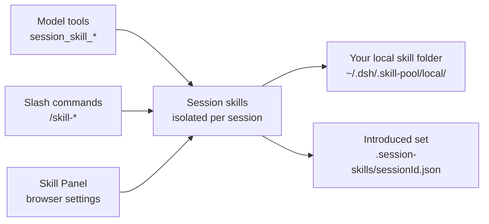

# dshp-skill-panel

[](https://www.npmjs.com/package/@super_camel/dsh-skill-panel)
[](LICENSE)
[](cordis.patch.yml)

**Session-level skill management for DeepSeek Harness — introduce and remove skills per session, with a convenient browser panel, model tools, and slash commands that all control the same skills.**

🚀 Session-level management | Convenient panel | Panel, commands, and tools stay in sync | Install with one command

[Highlights](#highlights) | [Who it is for](#who-it-is-for) | [Quick start](#quick-start) | [Toolbox](#toolbox) | [How it works](#how-it-works) | [Troubleshooting](#troubleshooting) | [FAQ](#faq)

🌐 **English** | [中文](README.zh.md)

## Highlights

- **Session-level skill management.** Introduce and remove skills per session — each session keeps its own isolated set, shadow overrides stay local, and nothing leaks between sessions. The introduced set survives host restarts.
- **A convenient management panel.** A browser settings section gives you a visual overview of your local skills and the current session's skills — search, expand details, and introduce or remove with a click.
- **Everything stays in sync.** The panel, the `session_skill_*` model tools, and the `/skill-*` slash commands all control the same skills — introduce or remove a skill in one place and it shows up everywhere.
- **Skills come from your own folder.** Skills live in your local folder (`~/.dsh/.skill-pool/local/`). Add a folder to manage a skill, delete it to remove it. This package ships no skills and does no subscription or catalog.

## Who it is for

1. You want the model to discover and load skills on its own — the `session_skill_*` tools let it browse, search, introduce, and remove skills autonomously.
2. You want to control skills directly from the chat — the `/skill-*` commands are for humans, no model in the loop.
3. You want a visual overview — the Skill Panel shows your local skills and the current session's introduced skills in one settings section.

## Quick start

### 1. Install

```sh
dsh plugin --profile web add @super_camel/dsh-skill-panel
```

Or install from source:

```sh
dsh plugin --profile web add github:kuramiwan/dshp-skill-panel
```

### 2. Restart and check

Restart `dsh web`, then open **Settings → 技能面板 (Skill Panel)**. You should see two views: your local skills, and the skills introduced into the current session.

### 3. Use it

```text
/skill-browse            # list your local skills
/skill-search <query>    # search your local skills
/skill-introduce <name>  # introduce a skill into this session
/skill-list              # list this session's skills
/skill-remove <name>     # remove a skill from this session
```

Or just ask the model — it can call the `session_skill_*` tools itself.

## Toolbox

### Model tools

Called by the model itself:

| Tool | What it does |
| --- | --- |
| `session_skill_browse` | List your local skills, with an optional query filter |
| `session_skill_search` | Search your local skills by keyword |
| `session_skill_list` | List the skills introduced into the current session |
| `session_skill_introduce` | Introduce a local skill into the current session |
| `session_skill_remove` | Remove a skill from the current session |

### Slash commands

Called by you, directly:

| Command | What it does |
| --- | --- |
| `/skill-browse [query]` | List your local skills, with an optional query filter |
| `/skill-search <query>` | Search your local skills by keyword |
| `/skill-list` | List the skills introduced into the current session |
| `/skill-introduce <name>` | Introduce a local skill into the current session |
| `/skill-remove <name>` | Remove a skill from the current session |

### Skill Panel

A browser settings section with two views — your local skills and the current session's introduced skills — with search, detail expansion, and shadow-override badges.

## How it works

The panel, the model tools, and the slash commands all operate on the same session-isolated skill list. Skills are read from your local folder, and the per-session introduced set is saved to disk.



Introducing a skill is a pure session registration — no files are copied; the registered resource points back at the original folder. Global skill layers (`~/.dsh/skills`, `~/.agents/skills`, project `.dsh/skills`) are process-level and visible to every session, so this plugin does not manage or display them.

## Troubleshooting

| Problem | What to do |
| --- | --- |
| Command results don't appear in a fresh empty session | The DSH client intentionally does not treat command nodes as conversation content. Send a message or refresh, or use commands in a session with existing history. |
| A skill I placed in the local folder doesn't show up | Make sure it is a subdirectory of `~/.dsh/.skill-pool/local/` containing a `SKILL.md`. |
| Global skills (`~/.dsh/skills`, etc.) don't appear | Those are process-level and not managed or displayed by this plugin; only the `local/` folder and the session introduced set are. |

## FAQ

**Does introducing a skill copy files?**

No. Introduction is a pure session registration that points back at the original folder.

**Are skills shared across sessions?**

No. Introductions are per-session and isolated; shadow overrides are per-session only.

**Does this package ship any skills?**

No. It manages your own local folder only — no bundled skills, no subscription, no catalog.

## License

[MIT](LICENSE) © 2026 super_camel
