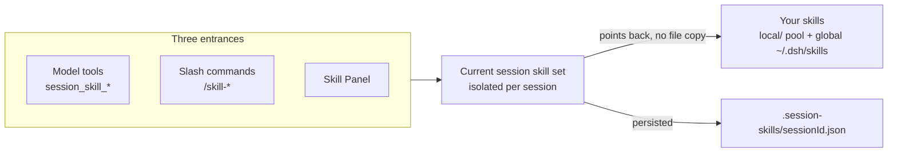

# dshp-skill-panel

[](https://www.npmjs.com/package/@super_camel/dsh-skill-panel)
[](LICENSE)
[](cordis.patch.yml)

**Session-level skill and plugin management for DeepSeek Harness — a browser panel that controls your skills, plugins, and session MCP, all in one settings section.**

🚀 Session-level skills | Visual panel | Plugin & MCP management | No restart for most changes | One-command install

[Highlights](#highlights) | [Who it is for](#who-it-is-for) | [Quick start](#quick-start) | [Skill management](#skill-management) | [Plugins and MCP](#plugins-and-mcp) | [How it works](#how-it-works) | [Troubleshooting](#troubleshooting) | [FAQ](#faq)

🌐 **English** | [中文](README.zh.md)

> **Version note.** This README describes the current release. If a documented capability is missing in your build, check the installed version against the changelog in [CHANGELOG.md](CHANGELOG.md).

## Highlights

**Skills**
- **Session-level skill management.** Introduce and remove skills per session — each session keeps its own isolated set, shadow overrides stay local, nothing leaks between sessions, and the introduced set survives host restarts.
- **A single skill view.** The **Skills** tab shows the global layer (`~/.dsh/skills`), your available pool (`~/.dsh/.skill-pool/local/`), and the current session's introduced set — search, expand details, and introduce, activate, or tag with a click.

**Plugins & MCP**

- **Plugin management.** Enable/disable user-installed plugins, add new ones, and promote bundle plugins to hot-pluggable — all from the **Plugins** tab, without editing config files.
- **Session MCP.** Add and tear down session-scoped MCP connections per session, independently from global config.

## Who it is for

1. You want a visual overview and click control of your skills and plugins in one settings section.
2. You want skills scoped per session — what one session introduces stays out of every other.
3. You want to enable/disable or hot-plug DSH plugins without restarting the host.
4. You want per-session MCP connections without hand-editing config.

## Quick start

### 1. Install

```sh
dsh plugin --profile web add @super_camel/dsh-skill-panel
```

Or install from source:

```sh
dsh plugin --profile web add github:kuramiwan/dshp-skill-panel
```

### 2. Restart and open the panel

Restart `dsh web`, then open **Settings → 技能面板 (Skill Panel)**. You get two tabs:

- **Skills** — the global layer, your available pool, and the current session's introduced set.
- **Plugins** — the plugins DSH has loaded, plus session MCP.

### 3. Try it

In the **Skills** tab, search your pool and introduce a skill into this session — it becomes available only here. In the **Plugins** tab, toggle a plugin and see it apply immediately (for patch-mounts).

## Skill management

The **Skills** tab is the everyday entry point. It shows three groups:

- **Global layer** (`~/.dsh/skills`) — process-level skills visible to every session; activate or deactivate them, and tag them. (Takes effect globally.)
- **Available pool** (`~/.dsh/.skill-pool/local/`) — skills you manage yourself. Place a folder here to add a skill, delete it to remove it. (These skills are not active anywhere until introduced.)
- **This session** — the skills introduced into the current session; remove one here and it disappears immediately. (Takes effect for this session only.)

> **Note:** To introduce a skill at the session level, first deactivate it from the global layer — then it can be introduced from the available pool at any time.

Skills are shown with search, expandable details, and badges marking a skill as **global** or **introduced**.

<details>
<summary><b>Power tools &mdash; slash commands and model tools</b></summary>

The same actions are also available without the panel, for automation or for the model:

```text
/skill-browse            list your available skills
/skill-search <query>    search your available skills
/skill-introduce <id>    introduce a skill into this session
/skill-list              list this session's skills
/skill-remove <id>       remove a skill from this session
```

The model can also call `session_skill_browse`, `session_skill_search`, `session_skill_list`, `session_skill_introduce`, and `session_skill_remove` itself.

</details>

## Plugins and MCP

The **Plugins** tab lists the plugins DSH has loaded, grouped by how they are mounted:

- **Built-in** — shipped with DSH, read-only.
- **User-installed (patch)** — mounted from `cordis.patch.yml`; enable/disable takes effect immediately, no restart.
- **User-installed (bundle)** — mounted from `dsh.profile.bundles`; enable/disable requires a restart.
- **MCP** — session-level connections, managed separately.

### Adding a plugin

The **Add plugin** button lets you register a plugin from the panel — give its package name (or an id) and the panel installs and mounts it, so it appears among the managed plugins.

### Making a bundle plugin hot-pluggable

A plugin installed with `dsh plugin install` that declares `dsh.bundle.patch` is mounted as a **bundle**: DSH reads `dsh.profile.bundles` once at startup, so enabling or disabling it only takes effect after a restart.

The **Make hot-pluggable** button converts a bundle plugin to a patch plugin, so you can enable and disable it without restarting:

1. Click **Make hot-pluggable** on the plugin. The panel removes it from `dsh.profile.bundles` and rewrites the installed package to drop its `dsh.bundle` declaration (an in-place fork), so DSH stops treating it as a bundle.
2. Restart DSH.
3. Click **Enable**. The plugin is now mounted from `cordis.patch.yml`, and enable/disable takes effect immediately.

> **Note:** The rewrite happens inside `node_modules`, so `pnpm update` or `dsh plugin update` overwrites it and restores the `dsh.bundle` declaration — promote again after updating. The original `package.json` is backed up as `package.json.bak` if you need to revert.

### Invasive plugins

Some plugins do not confine themselves to DSH's plugin seams. They monkey-patch DSH's internal services (e.g. `subprocess`, `sandbox`, `terminals`) or mutate `process.env` at runtime, and may copy files one-way (e.g. agent presets) on install.

The panel can only mount and unmount a plugin — it cannot undo what a plugin already did inside the process:

- **Runtime monkey-patches are irreversible.** A plugin that patches service prototypes without returning a disposer keeps its changes in memory after you disable it; only a DSH restart clears them.
- **One-way file syncs persist.** A plugin that copies files (like agent presets) on install does not remove them on uninstall; you must delete them yourself.
- **Sandbox bypass is a real trade-off.** Some Windows compatibility plugins disable the file sandbox for shell tools. Disabling the plugin does not restore the sandbox until restart.

Before installing a plugin that reaches into DSH internals, review what it patches and whether it can be cleanly reverted.

### Session MCP

Session MCP connections are scoped to the current session. Whitelist a server, connect it for the session, and disconnect when done — the panel keeps it out of the global config.

<details><summary>Model tools for MCP</summary>

The model can manage session MCP itself with `session_mcp_list`, `session_mcp_connect`, and `session_mcp_disconnect`.

</details>

## How it works

The panel and its tools all operate on the same **per-session** skill set. Introducing a skill is a pure session registration — no files are copied; the registered resource points back at the original folder. The per-session introduced set is saved to disk and replayed when the session resumes.



Plugins and session MCP (the other tab) are managed through the panel directly — see [Plugins & MCP](#plugins-and-mcp).

## Troubleshooting

| Problem | What to do |
| --- | --- |
| Command results don't appear in a fresh empty session | The DSH client intentionally does not treat command nodes as session content. Send a message or refresh, or run the command in a session with existing history. |
| A skill I placed in the available pool doesn't show up | Make sure it is a subdirectory of `~/.dsh/.skill-pool/local/` containing a `SKILL.md`. |
| A skill in the global layer (`~/.dsh/skills`) doesn't show up | Make sure it is a subdirectory of `~/.dsh/skills` containing a `SKILL.md`; the global layer is shown in the Skills tab's global group. |
| Something is wrong and you can't tell why | Run the plugin debugger to dump state + recent error logs in one shot (see below). |

### Debugging the plugin

The panel ships a standalone, read-only diagnostic script that inspects plugin state and recent error logs in one command — it does not require the host to be running and never modifies files.

```sh
pnpm debug                       # text dump: pool scan + session introduce-set + config + consistency check
pnpm debug --json                # same data as structured JSON
pnpm debug --root <dir>          # override the pool root
pnpm debug --profile <dir>       # override the DSH profile root
pnpm debug --logs 20             # include up to 20 recent error/warn log lines
```

> **Note:** The `pnpm debug` script is a dev/source tool. It is **not** shipped in the published npm bundle (which contains only `lib/index.js`, `lib/client.js`, and `cordis.patch.yml`) and requires Node ≥ 22.6 — clone the repo and run it from the source tree.

Structured logs are appended to `<dshHome>/.dshp-skill-panel.log` (JSON Lines) via `ctx.logger`, so the debugger's error clues and the live host logs are the same data source.

> **Agent guide**: the observability/debugging workflow (instrumentation rules, debugger protocol,
> compatibility, and the 5-step diagnosis) is codified for AI agents in
> [`docs/observability-sop.md`](./docs/observability-sop.md).

## FAQ

**Does introducing a skill copy files?**

No. Introduction is a pure session registration that points back at the original folder.

**Are skills shared across sessions?**

No. Introductions are per-session and isolated; shadow overrides are per-session only.

**Does this package ship any skills?**

No. It manages your own folders only — no bundled skills, no subscription, no catalog.

**Why don't my installed skills show up?**

If a skill isn't visible, check that it's a subdirectory containing a `SKILL.md` in one of the managed layers (`local/` or `~/.dsh/skills`), then refresh the panel.

## Development environments

One dsh kernel, multiple isolated `$DSH_HOME` roots. Production uses the
default root (`~/.dsh`, `web` profile only). Development uses a project-local
root (`.dsh-dev/`), completely separate from production — dev activity never
touches `~/.dsh`. Model config & credentials are shared across roots via
`config.path` pointing at the production files (zero copy, zero symlinks).

| Root | Profiles | Purpose |
|---|---|---|
| `~/.dsh` | `web` (npm release) | production |
| `<repo>/.dsh-dev` | `dev`, `test` (+ fixtures) | development / testing |

### One-time build (per machine)

```bash
# 1. build the panel checkout (required once; lib/ is git-ignored)
cd dshp-skill-panel && pnpm install && pnpm build

# 2. create the dev root + mount the panel (official entry point:
#    initProfile + pnpm add + reconcile bundles)
mkdir -p .dsh-dev
DSH_HOME="$PWD/.dsh-dev" dsh plugin --profile dev add "$PWD"
DSH_HOME="$PWD/.dsh-dev" dsh plugin --profile test add "$PWD"

# 3. (test only) fixtures — real copies, no symlinks
mkdir -p .dsh-dev/profiles/test/node_modules
cp -r test/fixtures/test-plugin .dsh-dev/profiles/test/node_modules/dshp-test-plugin
cp test/fixtures/test-profile/cordis.patch.yml .dsh-dev/profiles/test/cordis.patch.yml
mkdir -p .pool-test/local && cp -r test/fixtures/skill-pool/. .pool-test/local/
```

The wrapper scripts (`./dsh-dev`, `./dsh-test`) auto-complete the shared
credentials/settings patch (`config.path` → production `~/.dsh` files) on
first run, then start the environment.

### Daily usage — one command

```bash
./dsh-dev --port 3081        # development (DSH_HOME=.dsh-dev, dev profile)
./dsh-test --port 3081       # testing (DSH_HOME=.dsh-dev, test profile)
dsh --profile web --port 3081 # production (default ~/.dsh, npm release)
```

The panel auto-detects which profile it runs in via `ctx.baseUrl` (set by dsh
at boot to the profile directory) — no `profileDir` injection is needed.

### Credentials / model config sharing

Development roots point `settings` and `credentials` at the production files
via `config.path` (done automatically by the wrapper):

```yaml
# .dsh-dev/profiles/<name>/cordis.patch.yml (appended by ./dsh-<name>)
- id: settings
  config:
    path: $HOME/.dsh/settings.yaml
- id: credentials
  config:
    path: $HOME/.dsh/.credentials.yaml
```

- Model definitions & API keys are read from the production files (zero copy)
- Dev roots keep their own sessions / skills / profiles — production is never
  written by development

## Contributing

See [CONTRIBUTING.md](CONTRIBUTING.md) for development setup, building, and testing.

## License

[MIT](LICENSE) © 2026 super_camel
