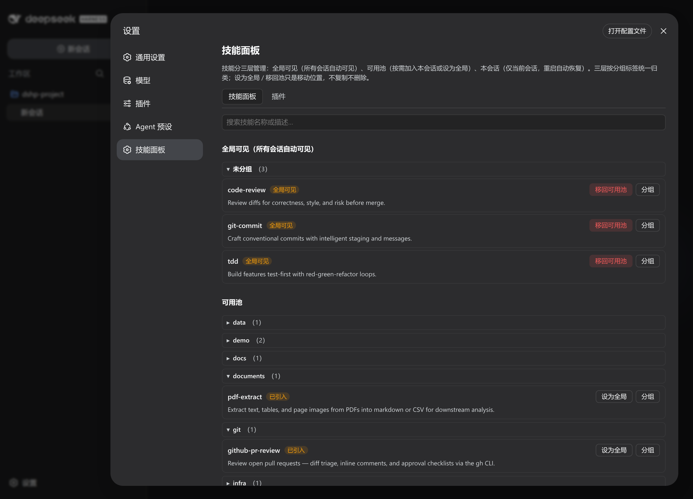
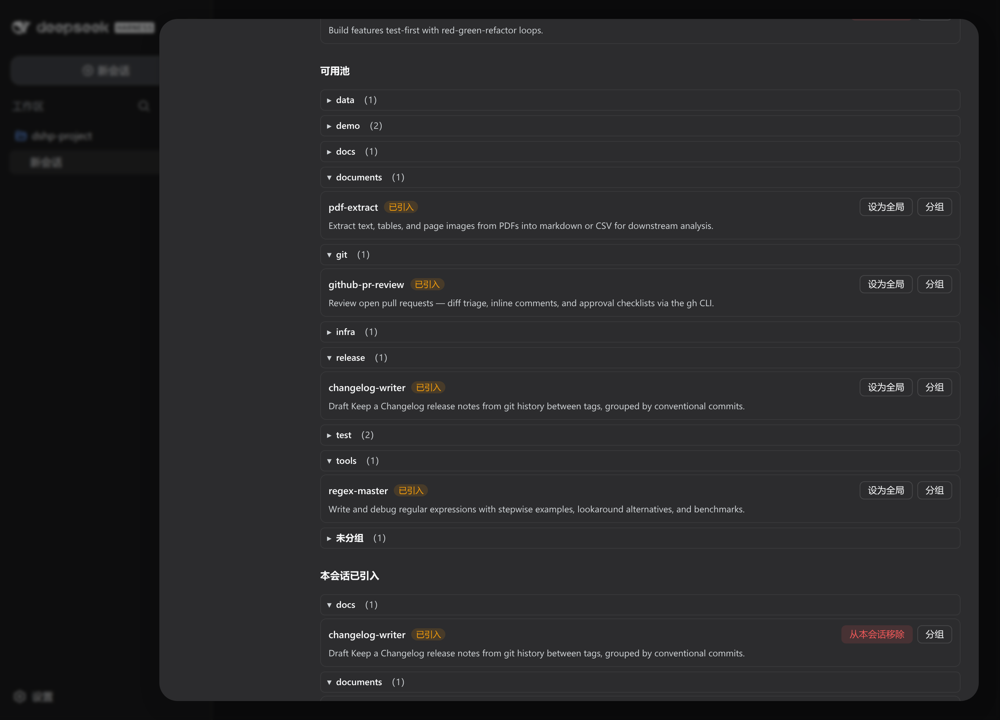
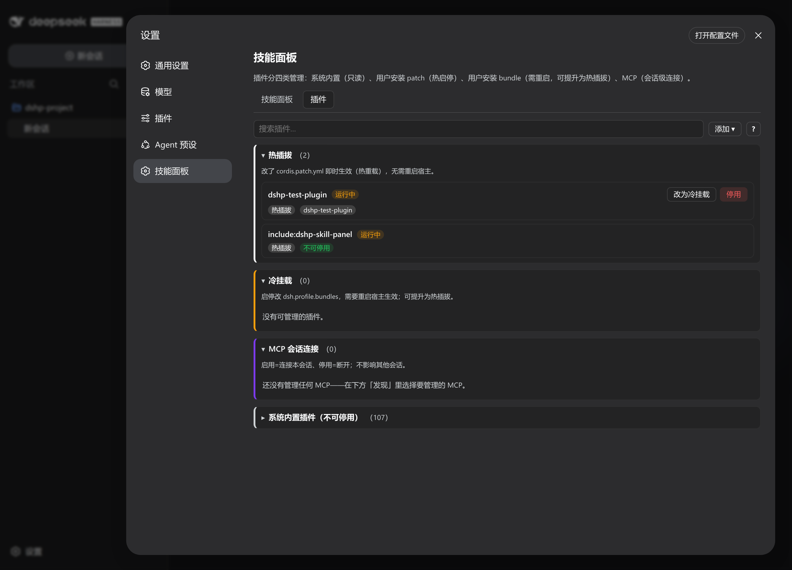
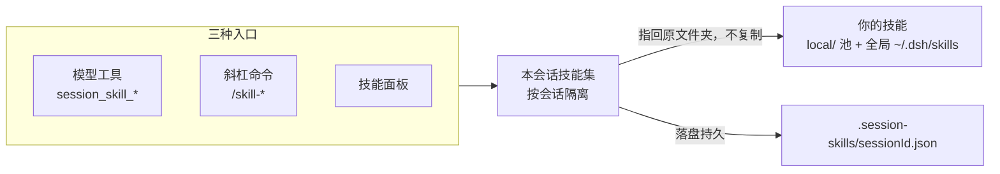

# dshp-skill-panel

[](https://www.npmjs.com/package/@super_camel/dsh-skill-panel)
[](LICENSE)
[](cordis.patch.yml)

**为 DeepSeek Harness 开发的会话级插件管理面板。随时添加、移除你的插件，热插拔生效，会话隔离，便捷的可视化面板。同时管理插件、skills、MCP。**

🚀 会话级技能 | 可视化面板 | 插件 & MCP 管理 | 多数改动免重启 | 一条命令安装

[Highlights](#highlights) | [Who it is for](#who-it-is-for) | [Quick start](#quick-start) | [Skill management](#skill-management) | [Plugins and MCP](#plugins-and-mcp) | [How it works](#how-it-works) | [Troubleshooting](#troubleshooting) | [FAQ](#faq)

🌐 [English](README.md) | **中文**

> **版本说明。** 本 README 描述当前发布版本。若你的安装里缺少文档中的某项能力，请对照 [CHANGELOG.md](CHANGELOG.md) 检查已安装版本。



## Highlights

**技能**

- **会话级技能管理。** 按会话引入、移除技能。每个会话有自己隔离的技能集，可热插拔，会话之间互不泄漏。

**插件 & MCP**

- **插件管理。** 启用/停用用户安装的插件、插件的冷挂载与热插拔状态随时切换。全在「插件」页签里，无需手改配置文件。
- **会话 MCP。** 按会话添加、拆除会话级 MCP 连接，与全局配置互相独立。

## Who it is for

1. 你想要一个可视化总览，在一个设置节里用鼠标控制你的技能与插件。
2. 你想要技能按会话隔离 —— 一个会话引入的，不进入任何其它会话。
3. 你想启用/停用或热插拔 DSH 插件，而不必重启宿主。
4. 你想要按会话的 MCP 连接，而不用手改配置。

## Quick start

### 1. 安装

```sh
dsh plugin --profile web add @super_camel/dsh-skill-panel
```

或从源码安装：

```sh
dsh plugin --profile web add github:kuramiwan/dshp-skill-panel
```

### 2. 重启并打开面板

重启 `dsh web`，打开 **设置 → 技能面板（Skill Panel）**。你会看到两个页签：

- **技能** —— 全局层、可用池、本会话已引入。
- **插件** —— DSH 已加载的插件，以及会话 MCP。

### 3. 试一试

在「技能」页签里搜索你的可用池并引入一个技能 —— 它只在本会话可用。在「插件」页签里切换一个插件，立即生效（patch 挂载）。

## Skill management

「技能」页签是日常入口，展示三组：

- **全局层**（`~/.dsh/skills`）—— 进程级、每个会话都可见的技能；可激活/停用、打 tag。（全局生效）
- **可用池**（`~/.dsh/.skill-pool/local/`）—— 你自己管理的技能。放一个文件夹进去即纳入管理，删掉即移出。（此处的技能不会在任何地方生效）
- **本会话** —— 从可用池引入到当前会话的技能；在这里移除，立刻消失。（会话级别生效）

技能支持搜索、展开详情，自行分组。

引入技能只需一次点击，面板会提示引入集已持久化、宿主重启后自动恢复：



<details>
<summary><b>高级工具 —— 斜杠命令与模型工具</b></summary>

同样的操作也可脱离面板进行，方便自动化或交给模型：

```text
/skill-browse            列出你的可用技能
/skill-search <query>    搜索你的可用技能
/skill-introduce <id>    把技能引入本会话
/skill-list              列出本会话已引入的技能
/skill-remove <id>       从本会话移除技能
```

模型也可以自己调用 `session_skill_browse`、`session_skill_search`、`session_skill_list`、`session_skill_introduce`、`session_skill_remove`。

</details>

## Plugins and MCP

「插件」页签列出 DSH 已加载的插件，按挂载方式分组：

- **系统内置** —— 随 DSH 提供，只读。
- **用户安装（patch）** —— 从 `cordis.patch.yml` 挂载；启用/停用立即生效，无需重启。
- **用户安装（bundle）** —— 从 `dsh.profile.bundles` 挂载；启用/停用需重启。
- **MCP** —— 会话级连接，单独管理。



### 新增插件

**「新增插件」** 按钮可让你直接从面板注册插件 —— 填入包名（或 id），面板即安装并挂载它，使其出现在受管插件列表里。

### 让 bundle 插件热插拔

用 `dsh plugin install` 安装、且声明了 `dsh.bundle.patch` 的插件会以 **bundle** 方式挂载：DSH 只在启动时读取一次 `dsh.profile.bundles`，所以启用/停用要重启才生效。

**「提升为热插拔」** 按钮把 bundle 插件转成 patch 插件，之后即可免重启启停：

1. 点插件上的 **「提升为热插拔」**。面板把它从 `dsh.profile.bundles` 移除，并重写已安装包的 `package.json`、去掉它的 `dsh.bundle` 声明（就地 fork），让 DSH 不再把它当 bundle。
2. 重启 DSH。
3. 点 **「启用」**。插件改从 `cordis.patch.yml` 挂载，启用/停用立即生效。

> **注意：** 重写发生在 `node_modules` 里，`pnpm update` 或 `dsh plugin update` 会覆盖它、恢复 `dsh.bundle` 声明 —— 更新后需重新提升。原始 `package.json` 备份为 `package.json.bak`，需要回退时可用。

### 侵入式插件

有些插件不局限于 DSH 的插件接口，而是直接 monkey-patch DSH 的内部服务（如 `subprocess`、`sandbox`、`terminals`）或修改 `process.env`，并可能在安装时单向复制文件（如 agent preset）。

面板只能挂载/卸载插件，无法撤销插件在进程内已经施加的改动：

- **运行时 monkey-patch 不可逆** 若插件修改了服务原型却没有返回 disposer，停用后这些改动仍留在内存里，只有重启 DSH 才能清除。
- **单向文件同步会残留** 若插件在安装时复制了文件（如 agent preset），卸载时不会删除它们，需要你手动清理。
- **绕过沙箱** 某些 Windows 兼容插件会为 shell 工具关闭文件沙箱；停用插件后沙箱要重启才恢复。

安装会深入 DSH 内部的插件前，先确认它 patch 了什么、能否干净地回退。

### Session MCP

会话 MCP 连接只作用于当前会话。白名单一个服务器、为本会话连上、用完断开 —— 面板把它隔离在全局配置之外。

<details><summary>面向模型的 MCP 工具</summary>

模型可以自己用 `session_mcp_list`、`session_mcp_connect`、`session_mcp_disconnect` 管理会话 MCP。

</details>

## How it works

面板和它的工具操作的是同一份**本会话**技能集。引入技能是纯会话注册 —— 不复制文件，注册的资源目录指回原文件夹。本会话的引入集落盘保存，会话恢复时自动重放。



插件与会话 MCP（另一个页签）由面板直接管理 —— 见 [Plugins & MCP](#plugins-and-mcp)。

## Troubleshooting

| 问题 | 怎么办 |
| --- | --- |
| 空白新会话里命令结果不显示 | DSH 客户端有意不把命令节点当会话内容。发一条消息或刷新，或在有会话历史的会话里使用命令。 |
| 放进可用池的技能没出现 | 确认它是 `~/.dsh/.skill-pool/local/` 下含 `SKILL.md` 的子目录。 |
| 全局层（`~/.dsh/skills`）里的技能没出现 | 确认它是 `~/.dsh/skills` 下含 `SKILL.md` 的子目录；全局层会显示在技能页签的全局分组里。 |
| 出问题但说不清原因 | 跑一次插件调试器，一次导出状态 + 最近错误日志（见下文）。 |

### 调试插件

面板附带一个独立、只读的诊断脚本，一条命令检查插件状态和最近错误日志 —— 它不需要宿主在运行，也从不修改文件。

```sh
pnpm debug                       # 文本导出：池扫描 + 会话引入集 + 配置 + 一致性检查
pnpm debug --json                # 同一份数据，结构化 JSON
pnpm debug --root <dir>          # 覆盖池根目录
pnpm debug --profile <dir>       # 覆盖 DSH profile 根目录
pnpm debug --logs 20             # 最多包含 20 条最近的 error/warn 日志
```

> **注意：** `pnpm debug` 脚本是**开发/源码工具**，**不会**随发布的 npm bundle 一起发布（bundle 只含 `lib/index.js`、`lib/client.js`、`cordis.patch.yml`），且需要 Node ≥ 22.6 —— 请克隆仓库后在源码树里运行。

结构化日志会通过 `ctx.logger` 追加到 `<dshHome>/.dshp-skill-panel.log`（JSON Lines），因此调试器的错误线索与宿主实时日志来自同一数据源。

> **Agent 指南**：面向 AI agent 的可观测性/调试工作流（埋点规范、调试器协议、兼容性、五步诊断）已沉淀在 [`docs/observability-sop.md`](./docs/observability-sop.md)。

## 开发环境

一个 dsh 内核，多个 `$DSH_HOME` 根隔离环境。生产用默认根（`~/.dsh`）；
开发用项目内根（`.dsh-dev/`），与生产**完全隔离**——开发活动不碰 `~/.dsh`。
两个根都跑**官方 `web` profile**（dsh-base + dsh-web-app + 面板，与生产同组合）；
dev/test 差异只在 patch 内容。模型配置与凭证经 `config.path` 指向生产文件
跨根共享（零复制、零软链）。

| 根 | profile | 用途 |
|---|---|---|
| `~/.dsh` | `web`（npm 发布版） | 生产 |
| `<仓库>/.dsh-dev` | `web`（仓库构建） | 开发（无 fixtures） |
| `<仓库>/.dsh-dev` | `web` + fixtures patch | 测试（dshp-test-plugin + test-mcp-stdio） |

### 一次性构建（每台机器一次）

```bash
# 1. 构建面板 checkout（clone 后必做；lib/ 不进 git）
cd dshp-skill-panel && pnpm install && pnpm build

# 2. 建开发根 + 挂载面板（官方入口：initProfile + pnpm add + reconcile bundles；
#    `web` 是官方模板，base + web-app 自动带上）
mkdir -p .dsh-dev
DSH_HOME="$PWD/.dsh-dev" dsh plugin --profile web add "$PWD"
```

就这些。wrapper 脚本（`./dsh-dev`、`./dsh-test`）首次运行自动补全：
凭证/设置共享 patch（`config.path` → 生产 `~/.dsh` 文件）；`./dsh-test`
额外补全 fixtures patch（dshp-test-plugin 行 + test-mcp-stdio MCP 桥接行，
fixture 包以真副本装入，不软链）。

### 日常使用 —— 单命令

```bash
./dsh-dev --port 3181         # 开发（DSH_HOME=.dsh-dev，web profile）
./dsh-test --port 3182        # 测试（同根，web profile + fixtures）
dsh --profile web --port 3081 # 生产（默认 ~/.dsh，npm 发布版）
```

面板通过 `ctx.baseUrl`（dsh 启动时设为 profile 目录）自动探测所在 profile，
无需注入 `profileDir`。

### 凭证/模型配置共享

开发根经 `config.path` 把 `settings` / `credentials` 指向生产文件（wrapper 自动完成）：

```yaml
# .dsh-dev/profiles/<name>/cordis.patch.yml（./dsh-<name> 自动追加）
- id: settings
  config:
    path: $HOME/.dsh/settings.yaml
- id: credentials
  config:
    path: $HOME/.dsh/.credentials.yaml
```

- 模型定义与 API key 直接读生产文件（零复制）
- 开发根保留自己的会话/技能/profile——开发绝不写生产

## FAQ

**引入技能会复制文件吗？**

不会。引入是纯会话注册，资源目录指回原文件夹。

**技能会在会话间共享吗？**

不会。引入按会话隔离；影子覆盖也只作用于当前会话。

**这个包会预置技能吗？**

不会。它只管理你自己的文件夹 —— 不预置技能、不做订阅、不做目录。

**为什么我装好的技能不显示？**

如果技能不可见，请确认它在受管层（`local/` 或 `~/.dsh/skills`）下、是含 `SKILL.md` 的子目录，然后刷新面板。

## 贡献

开发环境搭建、构建与测试见 [CONTRIBUTING.md](CONTRIBUTING.md)。

## License

[MIT](LICENSE) © 2026 super_camel
