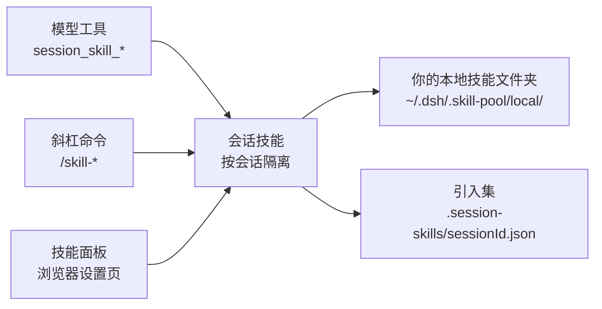

# dshp-skill-panel

[](https://www.npmjs.com/package/@super_camel/dsh-skill-panel)
[](LICENSE)
[](cordis.patch.yml)

**DeepSeek Harness 的会话级技能管理 —— 按会话引入、移除技能，配一个方便的管理面板，加上模型工具和斜杠命令，它们操作的都是同一份技能。**

🚀 会话级管理 | 方便的面板 | 面板、命令、工具始终同步 | 一条命令安装

[Highlights](#highlights) | [Who it is for](#who-it-is-for) | [Quick start](#quick-start) | [Toolbox](#toolbox) | [How it works](#how-it-works) | [Troubleshooting](#troubleshooting) | [FAQ](#faq)

🌐 [English](README.md) | **中文**

## Highlights

- **会话级技能管理。** 按会话引入、移除技能 —— 每个会话有自己隔离的技能集，影子覆盖只作用于本会话，会话之间互不泄漏；引入集在宿主重启后依然保留。
- **方便的管理面板。** 浏览器设置页里一个可视化面板，总览「本地技能」和「本会话已引入」两区 —— 搜索、展开详情、一键引入/移除。
- **处处同步。** 面板、`session_skill_*` 模型工具、`/skill-*` 斜杠命令操作的是同一份技能 —— 在任意一处引入或移除，其它地方立刻一致。
- **技能来自你自己的文件夹。** 技能放在你的本地文件夹（`~/.dsh/.skill-pool/local/`）。放一个文件夹进去即纳入管理，删掉即移出。本包不预置技能、不做订阅、不做目录。

## Who it is for

1. 你想让模型自己发现并加载技能 —— `session_skill_*` 工具让模型自主浏览、搜索、引入、移除技能。
2. 你想直接在对话里控制技能 —— `/skill-*` 命令面向人类，不经模型。
3. 你想要一个可视化总览 —— 技能面板在设置页里同时展示「本地技能」和「本会话已引入」两区。

## Quick start

### 1. 安装

```sh
dsh plugin --profile web add @super_camel/dsh-skill-panel
```

或从源码安装：

```sh
dsh plugin --profile web add github:kuramiwan/dshp-skill-panel
```

### 2. 重启并确认

重启 `dsh web`，打开 **设置 → 技能面板（Skill Panel）**。你会看到两区：本地技能，以及本会话已引入的技能。

### 3. 使用

```text
/skill-browse            # 列出本地技能
/skill-search <query>    # 搜索本地技能
/skill-introduce <name>  # 把技能引入本会话
/skill-list              # 列出本会话已引入的技能
/skill-remove <name>     # 从本会话移除技能
```

或者直接问模型 —— 它自己就能调用 `session_skill_*` 工具。

## Toolbox

### 模型工具

由模型自主调用：

| 工具 | 作用 |
| --- | --- |
| `session_skill_browse` | 列出本地技能，可带查询过滤 |
| `session_skill_search` | 按关键词搜索本地技能 |
| `session_skill_list` | 列出本会话已引入的技能 |
| `session_skill_introduce` | 把本地技能引入本会话 |
| `session_skill_remove` | 从本会话移除技能 |

### 斜杠命令

由你直接调用：

| 命令 | 作用 |
| --- | --- |
| `/skill-browse [query]` | 列出本地技能，可带查询过滤 |
| `/skill-search <query>` | 按关键词搜索本地技能 |
| `/skill-list` | 列出本会话已引入的技能 |
| `/skill-introduce <name>` | 把本地技能引入本会话 |
| `/skill-remove <name>` | 从本会话移除技能 |

### 技能面板

浏览器设置页里的一个节，含「本地技能 + 本会话已引入」两区，支持搜索、详情展开、影子覆盖标注。

## How it works

面板、模型工具、斜杠命令操作的是同一个会话隔离的技能列表。技能从你的本地文件夹读取，每个会话的引入集落盘保存。



引入技能是纯会话注册 —— 不复制文件，注册的资源目录指回原文件夹。全局技能层（`~/.dsh/skills`、`~/.agents/skills`、项目 `.dsh/skills`）是进程级、全会话可见，因此本插件不管理、不展示它们。

## Troubleshooting

| 问题 | 怎么办 |
| --- | --- |
| 空白新会话里命令结果不显示 | DSH 客户端有意不把命令节点当会话内容。发一条消息或刷新，或在有对话历史的会话里使用命令。 |
| 放进本地文件夹的技能没出现 | 确认它是 `~/.dsh/.skill-pool/local/` 下含 `SKILL.md` 的子目录。 |
| 全局技能（`~/.dsh/skills` 等）不显示 | 那些是进程级，本插件不管理、不展示；只管理 `local/` 文件夹和会话引入集。 |

## FAQ

**引入技能会复制文件吗？**

不会。引入是纯会话注册，资源目录指回原文件夹。

**技能会在会话间共享吗？**

不会。引入按会话隔离；影子覆盖也只作用于当前会话。

**这个包会预置技能吗？**

不会。它只管理你自己的本地文件夹 —— 不预置技能、不做订阅、不做目录。

## License

[MIT](LICENSE) © 2026 super_camel
