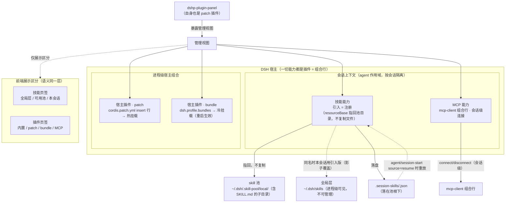

# 能力挂载（How it works 深图）

> 图契约：这张图声明 dshp-plugin-panel 作为 DSH 组合层管理视图，把
> 「一切能力都是插件（组合行）」统一语义下的三类能力（skill 文档能力 /
> MCP 外部工具能力 / 宿主插件）挂到两类挂载点（会话级 agent 上下文 /
> 进程级宿主组合）上的全貌，以及前端管理视图如何只做展示区分。
> 代码行为（src/actions.ts 三面同源动作、src/handles.ts SessionSkillStore 落盘与
> resume 重放、src/plugin-manager.ts patch/bundle 迁移）必须与图一致；不一致 = bug。
> 目的：README「How it works」主图的完整版——主图给用户看，本图给维护者/AI agent
> 对照源码用；skill 注册的引用式细节、落盘全路径、resume 触发点、影子覆盖都在这里。
> 日期：2026-09-02
> 读者：维护者 / AI agent（术语对齐 CONTEXT.md「插件（Plugin）」总概念）
> 关联：宿主插件 patch/bundle 的状态迁移见 [plugin-lifecycle.md](./plugin-lifecycle.md)，
> 一次插件操作怎么落盘见 [plugin-dataflow.md](./plugin-dataflow.md)——本图不重复维护。

**关键机制（源码级）**：
- **统一语义**：插件 = 宿主组合（cordis composition）可挂载行总概念（`CONTEXT.md`「插件」词条；
  `src/plugin-manager.ts:4-5`）；skill 与 MCP 是它的能力子类（skill 提供文档能力、MCP 提供外部工具能力）。
  前端（`src/client/sections.tsx:19` 两页签）只在展示时区分「技能 / 插件」。
- **skill 引入 = 纯会话注册**：`src/actions.ts:107-115` `skills.register`，`resourceBase:
  {kind:'directory', path: def.directory}` 指回池目录；正文 content 读入内存快照随注册携带，
  磁盘原文件零改动；移除只跑 disposer + `drop`（`src/actions.ts:122-129`），从不删池文件。
- **落盘全路径**：`<poolRoot>/.session-skills/<sessionId>.json`（默认
  `~/.dsh/.skill-pool/.session-skills/…`，`src/handles.ts:16,26`）；池根可被 `$DSH_HOME` 或
  插件配置 `poolRoot` 覆盖（`src/pool.ts:56-63`）。
- **回放只在 resume**：`src/index.ts:118-121` 仅 `agent/session-start` 的 `source==='resume'`
  触发 `replaySession`（`src/actions.ts:135-146`）；全新会话不重放；重放是 best-effort——
  池文件缺失只记 warn，不留可 remove 的残留清理。README/UI 文案凡说「重启自动恢复」均指
  resume 的会话。
- **影子覆盖**：引入与全局同名 skill 时，本会话用引入版本，其余会话仍用全局版本
  （dsh-skill 作用域链「最近层同名胜出」）。
- **宿主插件两挂载**：patch = `cordis.patch.yml` insert 行（watcher 热重载，改即生效）；
  bundle = `dsh.profile.bundles`（启动读一次，改需重启）；`promoteToPatch`/`demoteToBundle`
  迁移细节见 plugin-lifecycle / plugin-dataflow 图。
