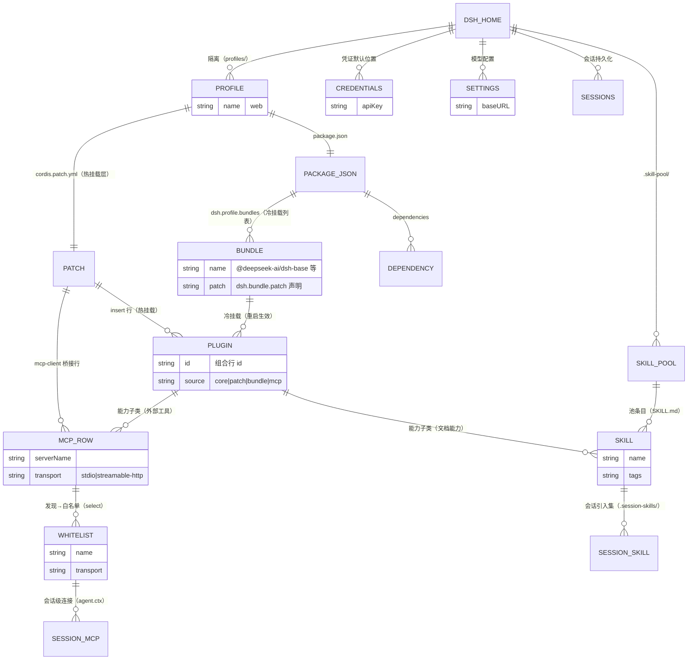

# 领域关系：DSH 环境与插件管理

> 图契约：这张图声明本项目的核心领域实体及其引用关系，覆盖两个域：
> (1) DSH 环境域——`DSH_HOME / profile / PACKAGE_JSON / DEPENDENCY / SETTINGS / CREDENTIALS / SESSIONS / SKILL_POOL`；
> (2) 插件与能力域——`PATCH / BUNDLE / PLUGIN / MCP_ROW / WHITELIST / SESSION_MCP / SKILL / SESSION_SKILL`。
> 节点命名对齐术语表（DSHP CONTEXT.md「插件管理」节）；图上出现的关系 = 代码里真实存在的引用。
> 目的：对齐领域概念、给并行子代理当共享术语纪要
> 日期：2026-08-28
> 读者：AI 优先
> 关联：环境拓扑与 `config.path` 共享机制的细节见 [env-topology.md](./env-topology.md)，本图不重复维护。

**关键事实**：
- **生产 web profile 的 patch 是裸 `[]`**：面板自身走 `dsh.profile.bundles` 冷挂载（4 个包），热挂载层只有用户手动 add 的行
- **dev/test 的 credentials/settings 是"引用"生产文件**（`config.path`）——隔离的是数据根，共享的是配置值；细节见 [env-topology.md](./env-topology.md)（本图不重复维护）
- **MCP 行在插件页是带会话连接动作的普通行**：`PluginSource = 'core' | 'patch' | 'bundle' | 'mcp'`；`isMcpClientConfig(config)` 按配置形状（serverName+transport）识别，不能按包名过滤
- **白名单文件 `.mcp-whitelist.json` 在 poolRoot 旁**，`disabledFile` 存全局 MCP 原始行（select 时挪走、deselect 时取回）

**未确认**：SKILL 的 tags 全局激活（globalActivate → user-dsh 层）在图外，属技能页签语义；本图只画环境 + 插件管理域。
