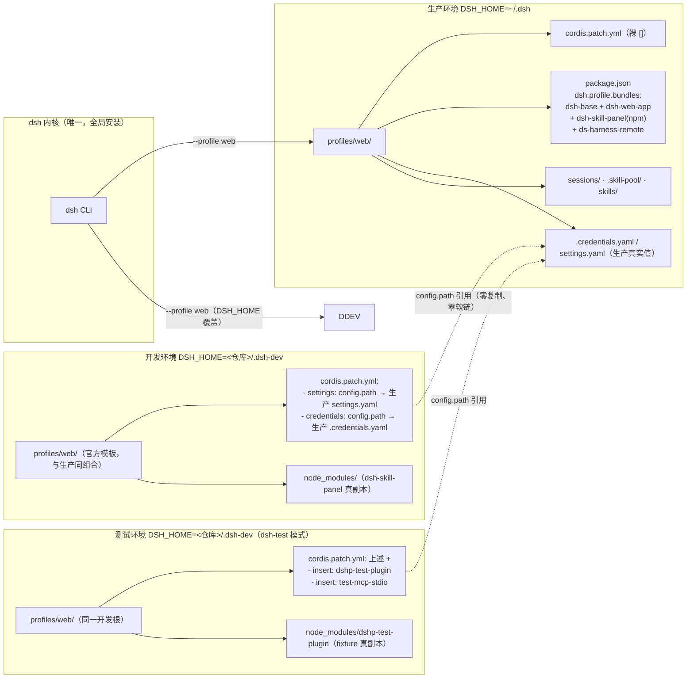

# 环境拓扑（一内核多 DSH_HOME）

> 图契约：这张图声明「一个 dsh 内核通过 DSH_HOME 根隔离 + 官方 web profile，拉起生产 / 开发 / 测试三个互不干扰的环境」的拓扑与共享边界。`dsh-dev` / `dsh-test` 包装器、`home.ts` 的 DSH_HOME 解析、`dsh.profile.bundles` 的组合组装必须与图一致。
> 目的：固化三环境方案（2026-08 定案），回答"为什么不用对拷/软链"
> 日期：2026-08-28
> 读者：AI 优先

**关键机制（源码级）**：
- `defaultDshHome()`（src/home.ts）：优先级 `$DSH_HOME > ~/.dsh`（`config` 层属于上游
  `@deepseek-ai/dsh-home-paths` 的 `resolveDshHome`，非本仓库；本仓库 `pool.ts` 仅注释对齐）。
  所有用户数据（profiles/sessions/skills）都跟随 DSH_HOME → 根隔离；settings/credentials
  的位置可被 profile patch 的 `config.path` 覆盖（见下条）——隔离的是数据根，共享的是配置值。
- 官方 `web` profile 模板 = `dsh-base + dsh-web-app`（含 webServer），与生产同组合；dev/test 差异只在 patch 内容（`dsh-dev` wrapper §2.5/§2.6 幂等补全）。此假设在
  `dsh-dev`/`dsh-test` 的 web-app bundle 自动补全（9e0505a）后已加守卫，随代码演化需复查（快照式）。
- **不复制、不软链**：dev 的模型配置/凭证是"引用生产文件"（`config.path`），不是拷贝（拷贝会漂移，软链在 Windows 有坑）
- 端口：生产 3081 / dev 3181 / test 3182（避免冲突）
- `profiles/node_modules/` 是 dsh 启动自动生成的软链目录（官方机制，指向全局内核）——**正常机制，勿删**

**未确认**：
- dev/test 的 `poolRoot` = `defaultPoolRoot()` = `join($DSH_HOME, '.skill-pool')`（pool.ts:56），
  随 DSH_HOME 隔离——dev/test 落在 `.dsh-dev/.skill-pool`（磁盘上存在）；但 dev/test 是否
  **共用**该池（而非各自隔离）未确认，若需测试页签隔离另见待办。
- 凭证的四层优先级（进程环境 > `$DSH_HOME/.credentials.yaml` > `<cwd>/.env` > `$DSH_HOME/.env`）
  在 src/ 中无对应逻辑，属上游内核行为（本仓库只经 `config.path` 引用文件位置）——本图按快照记录，勿当源码级。
