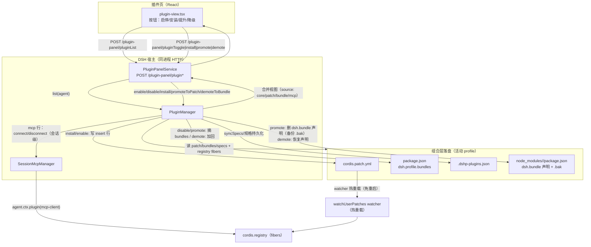

# 数据流：一次插件操作

> 图契约：这张图声明一次插件操作（install / toggle / promote / demote / list）从「面板点击」到「组合层落盘 + 热重载」的完整流转路径与写保护边界。`plugin-panel-service.ts` 的路由分发、`plugin-manager.ts` 的写保护、`mcp-manager.ts` 的会话级连接必须与图一致。
> 目的：理清"操作改了什么文件"——面板操作是写组合层（patch/bundles/状态文件），不是写会话
> 日期：2026-08-28
> 读者：AI 优先
> 关联：同一批 plugin-manager 操作（enable/disable/install/promoteToPatch/demoteToBundle）的
> 状态迁移见 [plugin-lifecycle.md](./plugin-lifecycle.md)——两图维护同一批操作，改代码需同步。

**写保护边界（每次写都过）**：
1. 备份原文件（`<patch>.bak` / `package.json.bak` / 包 `package.json.bak`）
2. 解析校验：新内容必须能 `js-yaml` 解析回顶层数组（patch）/ JSON（bundles）
3. 原子写（临时文件 + rename），避免半截文件被 watcher 读到
4. 失败回滚（mcp select 失败时 restoreGlobalMcp）

**关键事实**：
- **M9 修复**：`writePatch` 保留非字符串 id 行 + mcp 桥接行（`isMcpClientConfig`）——否则任意一次启停都会静默删掉同 patch 里的 mcp 行
- **promote 是就地 fork**：改 `node_modules/<pkg>/package.json`，`pnpm update` 会覆盖（需重新提升）
- **demote 前先 probe**：`probeBundleDeclaration` 只读校验（现有声明 / .bak / 包内 patch 文件三选一）通过才动 patch 行，避免半途失败留不一致态
- **M2**：停用 patch 行时若同包也在 bundles（reconcile 自动加回的双挂载），原子撤两处，标注 restartRequired
- **M8**：停用前先记录规格到 state 文件，保证停用后可重新启用

**未确认**：`ds-harness-remote`（生产 bundles 里的第 4 个包）不是本插件管理范围，图上未画其内部。
