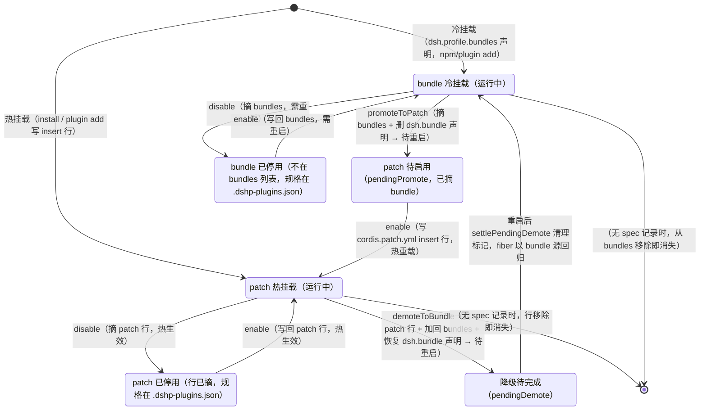

# 插件生命周期状态机

> 图契约：这张图声明一个用户插件行在「热挂载（patch）/ 冷挂载（bundle）/ 会话级（mcp）」三种挂载方式之间的全部合法状态与迁移。代码行为（src/plugin-manager.ts 的 enable/disable/install/promoteToPatch/demoteToBundle + settlePendingDemote）必须与图一致；不一致 = bug。
> 目的：对齐插件页签的挂载语义、固化 promote/demote 迁移（最近改动最多的部分）
> 日期：2026-08-28
> 读者：AI 优先

**状态说明（对照 `PluginFiberView`）**：
- `bundle` / `patch` / `patch_disabled` / `bundle_disabled`：`source` 分别为 `bundle` / `patch` / `patch`（spec） / `bundle`（spec），`active` 分别为 true / true / false / false
- `patch_pending`：`pendingPromote: true`，重启后用户点「启用」写 patch 行
- `bundle_demoting`：`pendingDemote: true`，重启后 `settlePendingDemote()`（list() 开头）判据：patch 行无该 id **且** 包在 bundles **且** fiber 以用户 bundle 源回归 → 清理标记
- **新插件直接进 patch**（install 写 insert 行，无 bundle 阶段）；要转冷挂载则 demote
- 停用后若无规格记录（从未 install 过、仅手动写 patch 行又被停），行移除后从视图消失——`syncSpecs` 只记录"面板管理过"的行

**未确认**：core 行的状态迁移不在图中（只读、不可操作）；mcp 行的启停=会话连接/断开，见数据流图。
